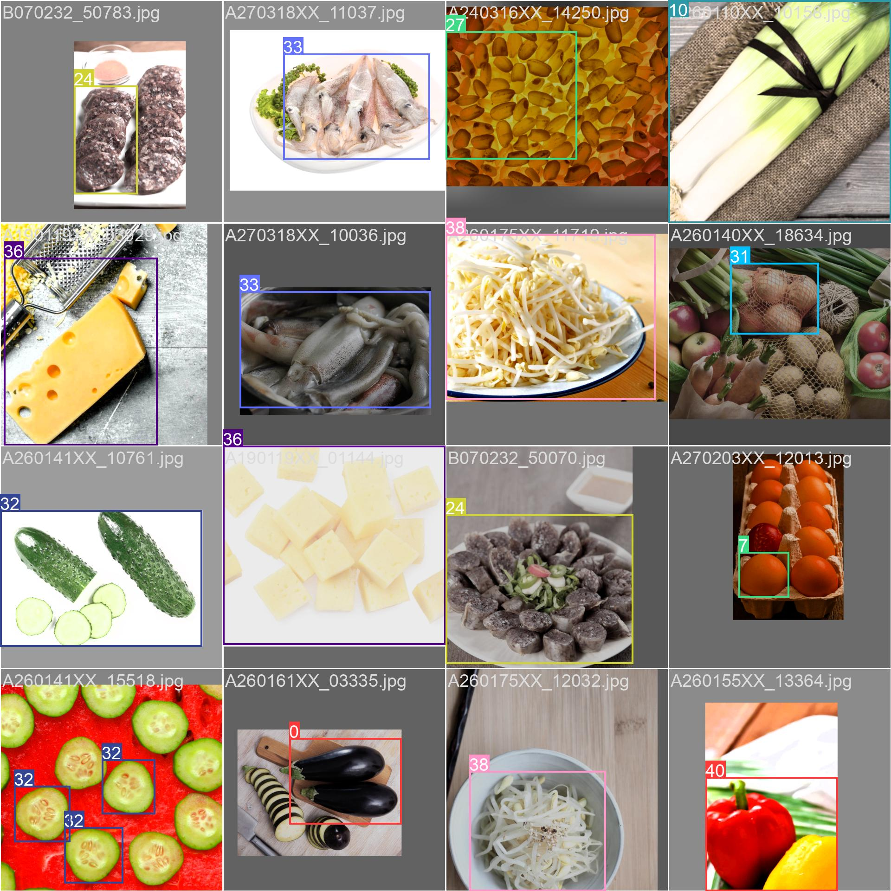

# AI 기반 레시피 추천 서비스 🍽️  

## 개요  
이 프로젝트는 **YOLO v8**을 활용하여 식재료를 인식하고, **Flask** 백엔드를 통해 **React** 프론트엔드로 데이터를 전달한 후, **GPT**를 활용하여 사용자에게 맞춤형 레시피를 추천하는 AI 기반 서비스입니다.  

## 주요 기능  
- **YOLO v8 기반 식재료 인식**: 이미지에서 식재료를 감지 및 분류  
- **Flask API 서버**: YOLO 모델을 통해 식재료를 분석하고 결과를 React로 전송  
- **React 프론트엔드**: 사용자 인터페이스(UI) 제공  
- **GPT 레시피 추천**: 감지된 식재료를 바탕으로 AI가 맞춤형 레시피 추천  

## 기술 스택  
### 모델  
- **YOLO v8**: 식재료 감지 및 분류 ([Ultralytics YOLO](https://github.com/ultralytics/ultralytics))  

### 백엔드  
- **Flask**: API 서버 및 데이터 처리  
- **FastAPI** (선택적 확장 가능)  

### 프론트엔드  
- **React.js**: 사용자 인터페이스(UI) 구현  
- **Tailwind CSS**: UI 스타일링  

### AI 추천  
- **GPT API (OpenAI)**: 감지된 식재료를 기반으로 맞춤형 레시피 생성  

## 분류 가능한 식재료 목록  
이 서비스는 YOLO v8을 사용하여 다음과 같은 식재료를 감지 및 분류할 수 있습니다:  

- **채소 및 곡물**: 가지, 고구마, 당근, 대파, 마늘, 배추, 김치, 버섯, 브로콜리, 숙주나물, 시금치, 쌀, 밥, 애호박, 양배추, 양파, 오이, 적양배추, 콩나물, 토마토  
- **육류 및 해산물**: 고등어, 닭가슴살, 삼겹살, 새우, 소시지, 순대, 오징어, 돼지고기, 비엔나소시지, 베이컨  
- **가공식품 및 기타**: 개맛살, 김, 두부, 달걀, 슬라이스치즈, 참치캔, 체다치즈, 치즈, 팽이버섯, 빨간파프리카, 노란파프리카, 파프리카

- ## 결과 예시
실시간 탐지 결과 예제:

